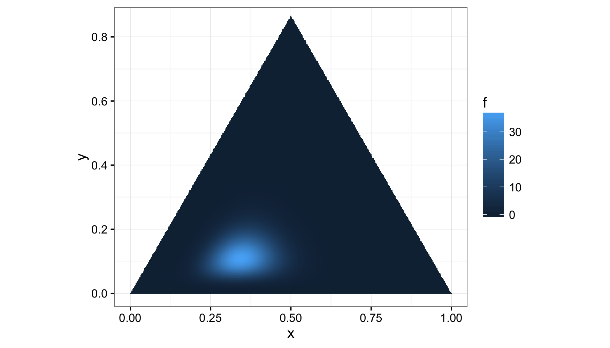
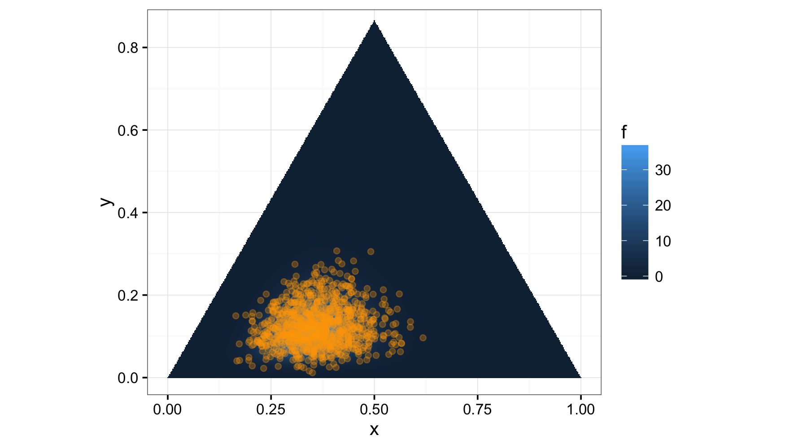

<!-- README.md is generated from README.Rmd. Please edit that file -->
**dirichlet**
=============

**dirichlet** implements the `(d/r)` statistics functions for the [Dirichlet distribution](https://en.wikipedia.org/wiki/Dirichlet_distribution) in [R](http://cran.r-project.org). It is ideal for using in other packages since it is light weight.

### Getting **dirichlet**

<!-- There are two ways to get __chi__.  For the [CRAN version](https://cran.r-project.org/package=chi), use -->
<!-- ```{r, eval=FALSE} -->
<!-- install.packages("chi") -->
<!-- ``` -->
<!-- For the development version, use -->
**dirichlet** is not yet on CRAN, so to get it use the following:

``` r
# install.packages("devtools")
devtools::install_github("dkahle/dirichlet")
```

### The `ddirichlet()` function

The [PDF](https://en.wikipedia.org/wiki/Probability_density_function) (the *f(x)*) can be evaluated with the `ddirichlet()` function:

``` r
library(dirichlet)
ddirichlet(c(.5,.5), c(.5, .5))
#  [1] 0.6366198
```

You can visualize it in barycentric coordinates like this:

``` r
library(dplyr, warn.conflicts = FALSE)
library(ggplot2); theme_set(theme_bw())
f <- function(v) ddirichlet(v, c(20, 10, 5))
mesh <- simplex_mesh(.0025) %>% as.data.frame %>% tbl_df
mesh$f <- mesh %>% apply(1, function(v) f(bary2simp(v)))
  
(p <- ggplot(mesh, aes(x, y)) +
  geom_raster(aes(fill = f)) +
  coord_equal(xlim = c(0,1), ylim = c(0, .85)))
```



Random number generation can be performed with `rdirichlet()`:

``` r
set.seed(1)
rdirichlet(5, c(1, 1, 1))  # rows sum to 1
#             [,1]       [,2]       [,3]
#  [1,] 0.09551263 0.71314033 0.19134704
#  [2,] 0.56339873 0.29631083 0.14029044
#  [3,] 0.82772645 0.14099156 0.03128199
#  [4,] 0.38355209 0.04340148 0.57304643
#  [5,] 0.51197942 0.06583319 0.42218738
rowSums(rdirichlet(3, c(1, 1, 1)))
#  [1] 1 1 1
```

You can visualize these points on top of the distribution above like this:

``` r
points <- rdirichlet(250, c(20, 10, 5)) %>% simp2bary %>% 
  as.data.frame %>% tbl_df %>% rename(x = V1, y = V2)

p + geom_point(data = points, color = "orange", alpha = .3)
```


